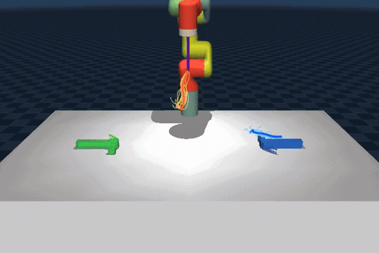
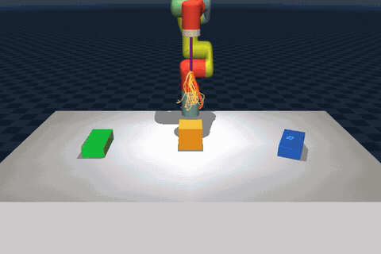
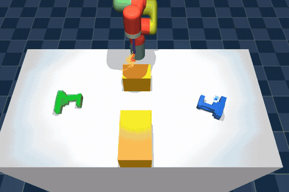
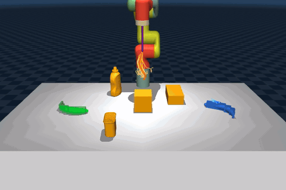
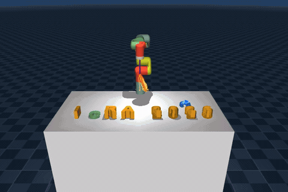
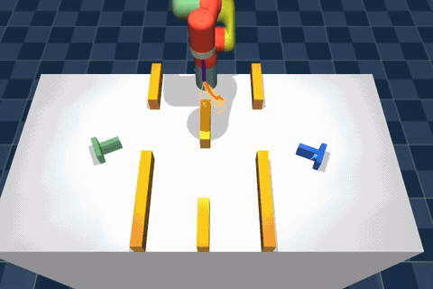

# Object-Informed Manipulation MJX

GPU-accelerated planning for **non-prehensile manipulation**, on
[JAX](https://jax.readthedocs.io/) and
[MuJoCo MJX](https://mujoco.readthedocs.io/en/stable/mjx.html).

**Object-informed MPPI** splits long-horizon pushing into an *object-level*
planner (what contact wrench does the object need?) and a *robot-level*
planner (how do I produce it?), coordinated by ADMM until the two agree on
the wrench. Both blocks accept any sampler from the library below as their
inner solver.

| | | |
| :-: | :-: | :-: |
|  |  |  |
| **`open_table`** · hammer<br/>the unobstructed 180° flip | **`single_obstacle`** · sugar box<br/>a cube on the direct path | **`shelf_gap`** · power drill<br/>through the gap between two shelves |
|  |  |  |
| **`ycb_clutter`** · banana<br/>cube, spam can, sugar box, mustard | **`icra_sign`** · the C<br/>90° turn into the empty slot | **`slalom`** · the T<br/>three gates, no straight line through |

<sub>One ADMM run per clip, sped up; blue is the object, green its goal.
`--object` puts a different object into a scene without touching its
layout — see [Objects](#objects).</sub>

- [Setup](#setup) · [Algorithms](#algorithms) · [Running](#running) ·
  [Method](#method) · [Citation](#citation)

## Setup

Python ≥ 3.12, CUDA 13, [uv](https://docs.astral.sh/uv/).

```bash
git clone https://github.com/NikolaRaicevic2001/Object-Informed-Manipulation-MJX.git
cd Object-Informed-Manipulation-MJX && uv sync
```

| | |
| --- | --- |
| `uv run <cmd>` | Run in the environment (or `source .venv/bin/activate`) |
| `uv run pytest` | Tests |
| `uv run ruff check .` | Lint |

## Algorithms

| Algorithm | Description | Import |
| --- | --- | --- |
| **[ADMM object-informed MPPI](#method)** | **Hierarchical object/robot decomposition, coordinated to consensus on the contact wrench.** | [`oim.algs.ADMM`](oim/algs/admm.py) |
| [Predictive sampling](https://arxiv.org/abs/2212.00541) | Take the lowest-cost rollout. | [`oim.algs.PredictiveSampling`](oim/algs/predictive_sampling.py) |
| [MPPI](https://arxiv.org/abs/1707.02342) | Exponentially weighted average of rollouts. | [`oim.algs.MPPI`](oim/algs/mppi.py) |
| [CEM](https://en.wikipedia.org/wiki/Cross-entropy_method) | Fit a Gaussian to the `n` elite rollouts. | [`oim.algs.CEM`](oim/algs/cem.py) |
| [DIAL-MPC](https://arxiv.org/abs/2409.15610) | MPPI with dual-loop annealed covariance. | [`oim.algs.DIAL`](oim/algs/dial.py) |
| [MPPI-CMA](https://arxiv.org/pdf/2506.22087) | MPPI with an adaptive sampling distribution. | [`oim.algs.MppiCma`](oim/algs/mppi_cma.py) |
| [MTP](https://arxiv.org/abs/2505.01059) | Structured tensor sampling + local CEM update. | [`oim.algs.MTP`](oim/algs/mtp.py) |
| [CBO](https://en.wikipedia.org/wiki/Consensus_based_optimization) | SDE pulling samples toward a consensus point. | [`oim.algs.CBO`](oim/algs/cbo.py) |
| [Evosax](https://github.com/RobertTLange/evosax/) | 30+ evolution strategies (CMA-ES, DE, …). | [`oim.algs.Evosax`](oim/algs/evosax.py) |


## Running

Planar pushing: drive an object to an SE(2) goal past static obstacles.

### Tasks

| `examples/pusht/` | Object → goal | In the way |
| --- | --- | --- |
| `clutter.py` | T, 45° turn | disc, box, triangle — and the only 3D scene with a point-mass embodiment |
| `open_table.py` | T, 180° flip | nothing — the unobstructed baseline |
| `single_obstacle.py` | T, 180° flip | one 0.1 m cube on the direct path |
| `shelf_gap.py` | T, 180° flip | two shelves; the gap is 2.2× the T's crossbar |
| `ycb_clutter.py` | T, 180° flip | that cube plus spam can, sugar box, mustard bottle |
| `icra_sign.py` | C, 90° turn | seven glyphs spelling *ICRA 2026*; the goal is the empty C slot |
| `slalom.py` | T, 180° flip | three gates, openings alternating near/far/near — no straight line through |
| `box_clutter_real.py` | T, 90° turn | three pudding boxes — the lab's own measured layout |
| `open_table_real.py` | T, 90° turn | nothing — sim twin of the hardware run |
| `single_obstacle_real.py` | T, 90° turn | one pudding box, squarely on the path |

### Objects

`--object` (or `run.object`) changes what is pushed; the scene keeps its table,
obstacles and goal pose. Each is a box decomposition with the mesh drawn over
it, so concavities survive into contact — "hull" is how much of the true
footprint the boxes reach. See [`oim/objects/library.py`](oim/objects/library.py).

| `--object` | Plan | Height | Mass | Hull |
| --- | --- | --- | --- | --- |
| `scene` | the MJCF's own — the T, or `icra_sign`'s C | 0.060 m | 0.100 kg | — |
| `banana` | 0.104 × 0.162 m | 0.037 m | 0.066 kg | 75% |
| `hammer` | 0.090 × 0.180 m | 0.032 m | 0.600 kg | 86% |
| `power_drill` | 0.133 × 0.144 m | 0.046 m | 0.458 kg | 84% |
| `sugar_box` | 0.172 × 0.090 m | 0.049 m | 0.514 kg | 96% |
| `tomato_soup` | 0.064 m ⌀ | 0.102 m | 0.349 kg | 93% |

| # | World | Command | A failure here is |
| --- | --- | --- | --- |
| 1 | object only | `examples/pusht/object_only.py` | the object-level formulation: costs, action bounds, sampler budget |
| 2 | 3D ADMM | `examples/pusht/<scene>.py` | MJX contact, reachability, or the arm |
| 3 | hardware | `examples/pusht/pusht_real.py` | sim-to-real — see [Running on the real xArm6](#running-on-the-real-xarm6) |

#### 1 — the object block alone

Every flag at once, so the table below reads against something concrete.
None of it is required:

```bash
uv run python examples/pusht/object_only.py \
    --scene shelf_gap --robot xarm6 \
    --plant mujoco --friction box --object-substeps 2 \
    --object-opt mppi --consensus contact_point --iterations 3 \
    --wrench-fraction 1.4 --w-rate 2.0 2.0 1.0 --w-contact-rate 16 16 1 \
    --noise-level 0.2 --temperature 0.1 \
    --horizon 24 --samples 256 --steps 200 --seed 1 \
    --start random --goal random \
    --record --show-samples --show-optimal --show-contact-point
```

| Flag | |
| --- | --- |
| `--scene`, `--robot` | any `SCENES` key; no robot is simulated, but `--robot` picks the config file and the scene variant |
| `--start`, `--goal` | pose key from [`examples/poses/`](examples/poses/), or `random`. Unset is the scene's own |
| `--plant` | which dynamics the run uses, predicting *and* executing — `analytic` or `mujoco`. |
| `--friction` | shape of the simulated support friction — `box`, `cone`, `wrench`. MuJoCo-executing modes only; see [`plant.py`](oim/worlds/object_only/plant.py) |
| `--object-substeps` | MJX steps per planning step, where the mode predicts with MuJoCo |
| `--object-opt` | sampler — `mppi`, `cem`, `ps`, `cbo` |
| `--consensus` | what the block **samples in** — `wrench` $[f_x, f_y, \tau]$, or `contact_point` $[p_x, p_y, \lambda]$ on the boundary with $w = J_c^\top f$ derived each step |
| `--iterations` | optimizer passes per step. Matching it to `n_admm` is what makes this the same experiment as ADMM's own block |
| `--horizon`, `--samples` | $H$, and rollouts per pass |
| `--wrench-fraction` | fraction of the friction-cone limit a unit action maps to — $f_{\max}$ under `contact_point`. Decides whether the block can move the object at all |
| `--w-rate` / `--w-contact-rate` | penalty on the step-to-step change in the decision — the first in wrench units, the second in the contact parameterization's, whichever `--consensus` selects. The only term that knows relocating a contact is a real maneuver |
| `--noise-level`, `--temperature` | sampler noise and softmax temperature. `--noise-level` is inert under `contact_point`, whose proposal is the task's own boundary sampler |
| `--record`, `--show-samples`, `--show-optimal`, `--show-contact-point` | mp4 of the simulated scene and what it overlays. Needs a MuJoCo-**executing** plant; the dots need `--consensus contact_point` |
| `--no-plot`, `--no-jit` | skip the PNG, eager mode |
| `--steps`, `--seed` | control steps, RNG seed — taken directly, there being no algorithm subcommand |

Run files go to `results/object/`, **not** `results/runs/` — no robot and no
replanning rate, so they must not average into `run_eval`'s tables:

```bash
uv run python -m oim.run_eval --runs-dir oim/results/object --plot
```

#### 2 — 3D ADMM

Every flag at once, so the table below reads against something concrete.
None of it is required:

```bash
uv run python examples/pusht/shelf_gap.py \
    --robot xarm6 --warp \
    --samples 128 --object-samples 256 --horizon 24 \
    --start 2 --goal 4 --gamma0-deg 60 \
    --record --show-samples --show-optimal --show-contact-point --no-plot \
  admm \
    --plant analytic --object-substeps 2 --robot-substeps 4 \
    --robot-opt mppi --object-opt mppi \
    --consensus wrench --consensus-object-weight 0.5 \
    --n-admm 4 --rho 2.0 --rho-torque 2.0 --gamma 0.1 \
    --steps 300 --seed 1 --headless
```

Flags before `admm` belong to the world, after it to the algorithm. Every
default comes from `oim/configs/robots/{robot}.yaml`.

| Flag | |
| --- | --- |
| `--robot` | embodiment, limited to those the scene has an MJCF for. Also picks the config file |
| `--warp` | [MuJoCo Warp](https://mujoco.readthedocs.io/en/latest/mjwarp/) rollouts instead of JAX; also disables JAX's GPU preallocation, which Warp needs |
| `--start`, `--goal` | pose key from [`examples/poses/`](examples/poses/) — five of each per scene. Unset draws one (seeded by `--seed`); the run file records which |
| `--samples`, `--horizon` | rollouts per block, and the consensus horizon $H$ both blocks share |
| `--object-samples` | rollouts for the object block alone, overriding `--samples` |
| `--gamma0-deg` | half-angle of the alignment cone in the robot's approach cost |
| `--record`, `--show-samples`, `--show-optimal`, `--show-contact-point` | mp4 (needs `ffmpeg`; offscreen under `--headless`) and what it overlays. The dots need `--consensus contact_point` |
| `--no-plot` | skip the summary PNG |
| `--plant` | which dynamics the **object block plans against** — `analytic` (eq. 5) or `mujoco` (MJX, alongside the robot block). Execution is always MuJoCo, so there is no execution side to pick. `mujoco` costs ~0.89 ms per horizon step per round |
| `--object-substeps`, `--robot-substeps` | MJX steps per planning step in each block's rollout |
| `--robot-opt`, `--object-opt` | inner sampler per block — `mppi`, `cem`, `ps`, `cbo`. Chosen independently |
| `--consensus` | what the blocks agree on — `wrench` $[f_x, f_y, \tau]$ (eq. 24), `contact_point` $[p_x, p_y, \lambda]$, or `object_pose` $[x, y, \theta]$. The first two also drive the object block's sampling space; `object_pose` leaves it sampling wrenches |
| `--consensus-object-weight` | the object block's share $w_o$ of the $z$-update. 0.5 is the paper's average; above it tilts $z$ toward the object block's plan |
| `--n-admm`, `--rho`, `--rho-torque`, `--gamma` | consensus rounds per control step; penalty $\rho$ and its torque channel separately; proximal weight $\gamma$ |
| `--steps`, `--seed`, `--headless` | control steps, RNG seed, no viewer |

### Sweeps

```bash
uv run python -m oim.run_launch                          # the whole product
uv run python -m oim.run_launch --config ablation        # six methods x one parameter at a time
uv run python -m oim.run_launch --config object_only     # a name under oim/configs/sweeps/, or a path
uv run python -m oim.run_launch --dry-run                # print each cell's exact command, run none
uv run python -m oim.run_launch --only algorithm=admm    # keep only matching cells; repeatable, KEY=A,B
uv run python -m oim.run_launch --set steps=50           # override `fixed:`; unknown keys rejected up front
uv run python -m oim.run_launch --warp --stop-on-error   # --set warp=true; abort on the first failure
uv run python -m oim.run_launch --manifest-dir out --gpu-timeout 300   # run record; seconds to wait for free GPU
```

| Axis | Worlds | |
| --- | --- | --- |
| `task` | all | `{ script: <name> }` plus any flags for it, resolved against `examples/**` |
| `scene` | object | `--scene`, an axis only where the world has no MJCF of its own |
| `object` | 3D | `scene` (the MJCF's own) or a key of [`PUSH_OBJECTS`](oim/objects/library.py) — independent of the scene |
| `algorithm` | 3D | `admm`, `mppi`, `ps`, `c3` — or `{ algorithm: admm, consensus: …, lagged_consensus: … }`, one variant per cell instead of a product. Every `admm` axis below is dropped for a flat cell |
| `consensus` | object, 3D `admm` | `wrench`, `contact_point`, `object_pose` |
| `plant` | object, 3D `admm` | `analytic`, `mujoco` |
| `friction` | object | `box`, `cone`, `wrench` |
| `robot_opt` | 3D `admm` | `mppi`, `cem`, `ps`, `cbo` |
| `object_opt` | object, 3D `admm` | `mppi`, `cem`, `ps`, `cbo` |
| `horizon`, `samples` | all | $H$, and rollouts per block |
| `object_samples` | 3D | rollouts for the object block alone |
| `n_admm`, `rho`, `gamma`, `consensus_object_weight` | 3D `admm` | rounds per step, $\rho$, $\gamma$, the object block's share $w_o$ of the $z$-update |
| `wrench_fraction`, `contact_fraction` | object | wrench action scale; $\lambda$'s ceiling under `contact_point` |
| `w_rate`, `w_contact_rate`, `noise_level` | object | object-block tuning |
| `temperature` | object, 3D | MPPI softmax — the object block's in the object world, the robot's in 3D |
| `start`, `goal` | all | pose keys from [`examples/poses/`](examples/poses/) — varies the *problem*, where `seed` alone only redraws the noise |
| `seed` | all | RNG seed |
| `[]` | | drops the axis; one a script has no flag for is dropped before cells are deduplicated |
| `fixed:` | | applied to every cell — `object_substeps`, `rho_torque`, `iterations` and the rest, which are not axes |
| `ablate:` | | a second block beside `sweep:`, **not** crossed: each axis in it is varied alone against the base sweep, so six parameters of four values cost 24 extra cells and not 4096 |

### Evaluation

```bash
# the whole ablation sweep, one row per axis that moves
uv run python -m oim.run_eval --ablate samples horizon n_admm rho consensus_object_weight temperature iterations

uv run python -m oim.run_eval                          # every run, no ablation
uv run python -m oim.run_eval --format latex           # paper-ready tabular
uv run python -m oim.run_eval --runs-dir oim/results/object --plot
uv run python -m oim.run_eval --pos-tol 0.02           # re-score, no re-running
```

| Flag | |
| --- | --- |
| `--ablate FIELD …` | label rows by these fields; repeatable |
| `--filter KEY=A,B` | keep matching runs; repeatable. One field's values OR-ed, different fields AND-ed |
| `--group-by` | fields forming each block (default `task`); methods are always the rows inside |
| `--plot` | step-curve figure ($\epsilon_d$, $\epsilon_\theta$, ADMM primal/dual residuals) |
| `--pos-tol`, `--theta-tol` | re-score success against a new tolerance |
| `--format` | `text` (default), `markdown`, `latex`. A `.txt` is always written; this adds a second file |
| `--runs-dir` | run files to score (default `oim/results/runs/`; `oim/results/object/` for object-only runs) |
| `--out-dir`, `--no-save` | where output goes (default `oim/results/eval/`); or print only |

| Column | Paper | |
| --- | --- | --- |
| `n` | — | trials in the cell |
| `SR` | SR | fraction reaching both tolerances, re-derived from the final pose |
| `eps_d` | $\epsilon_d$ | position error averaged **over the trajectory**, not the final value, so it stays large even at SR 1.0 |
| `eps_d^s` | $\epsilon_d^s$ | same, successful trials only; blank if none succeeded |
| `theta` | — | orientation error, same trajectory mean |
| `steps` | $N$ | control steps to first meet both tolerances; a trial that never does is censored at the run's `steps` |
| `f (Hz)` | $\bar{f}$ | wall-clock planning rate, from the recorded `compute_time` |
| `T (s)` | $T$ | *simulated* time (`steps_run × dt`), machine-independent; a failed trial is credited the slowest time across every loaded run |

## Method

A robot manipulates an unactuated rigid object through contact. Rather than
one monolithic contact-implicit problem, this is **two subsystems coupled
only through a shared consensus variable**, reconciled by ADMM.

### Subsystem models

| | Dynamics | |
| --- | --- | --- |
| Robot | $x^r_{t+1} = f_r(x^r_t) + g_r(x^r_t) u^r_t + h_r(x^r_t) w^r_t$ | input-affine, stepped in MJX |
| Object | $x^o_{t+1} = f_o(x^o_t) + h_o(x^o_t) w^o_t$ | unactuated; moves only via the wrench |

The object planner treats $w^o_t \triangleq [f_x, f_y, \tau]^\top$ as a
*decision variable* rather than the outcome of complementarity constraints.
For quasi-static planar pushing the **ellipsoidal limit surface** closes the
model with no simulator in the loop:

```math
\dot{x}^o = D\,w^o \max\!\big(0,\ 1 - 1/s\big),
\qquad s = \lVert w^o / D^{-1}\rVert,
\qquad D^{-1} = \mathrm{diag}\big(\mu m g,\ \mu m g,\ c\,r\,\mu m g\big)
```

$D^{-1}$ is the **friction-cone limit** — the largest wrench the support can
transmit — and is reused throughout as the natural normalizer. The
$\max(0, 1 - 1/s)$ factor is Coulomb's: a wrench inside the cone produces no
motion, and motion goes continuously to zero at the boundary. $\mu, m, r$ are
the object's, from [`oim/objects/library.py`](oim/objects/library.py); $c = 1$.

### Consensus problem

Over horizon $H$, with $\mathbf{Z} = \{z_t\}$ shared:

```math
\begin{aligned}
\min_{\mathbf{W}^o,\, \mathbf{U}^r,\, \mathbf{Z}} \quad
& \sum_{t=0}^{H-1}\Big(\ell_o(x^o_t) + \ell_r(x^r_t, u^r_t)\Big) + \ell_f(x^o_H) \\
\text{s.t.}\quad
& x^o_{t+1} \text{ via } w^o_t, \quad x^r_{t+1} \text{ via } u^r_t, \quad (x^r_t, u^r_t) \in \mathcal{C}, \\
& A^o_t = z_t, \qquad A^r_t = z_t .
\end{aligned}
```

$A^o$ is a selection off the object block's own decision; $A^r$ is **not** a
decision variable — it is whatever the MJX rollout produces once
$\mathbf{U}^r$ is applied. Splitting $\mathbf{W}^o$ from $\mathbf{U}^r$
through $z_t$ is what lets the two planners run independently.

### ADMM iteration

The $N = 2$ case of global-variable-consensus ADMM. Each iteration $l$:

| # | Step | |
| --- | --- | --- |
| 1 | $\mathbf{U}^{i,(l+1)} = \mathrm{arg\,min} \big\{ J_i + \tfrac{\gamma}{2}\lVert \mathbf{U}^i - \mathbf{U}^{i,(l)}\rVert^2 + \tfrac{\rho}{2}\sum_t \lVert A^i_t - z^{(l)}_t + y^{i,(l)}_t\rVert^2 \big\}$ | both blocks, $i \in \{o,r\}$; penalties evaluated inside the sampler's rollout cost |
| 2 | $z^{(l+1)}_t = w_o\big(A^o_t + y^{o}_t\big) + (1 - w_o)\big(A^r_t + y^{r}_t\big)$ | $w_o = \tfrac12$ is eq. 27, the plain average |
| 3 | $y^{i,(l+1)}_t = y^{i,(l)}_t + A^i_t - z^{(l+1)}_t$ | duals integrate disagreement, clipped to $\pm y_{\max}$ |
| 4 | $\rho \leftarrow 2\rho$ if $\lVert r\rVert > 10\lVert d\rVert$; $\rho/2$ if $\lVert d\rVert > 10\lVert r\rVert$ | off by default |

The proximal term $\gamma > 0$ is inertia between iterations: it prevents the
radical trajectory shifts non-convex contact dynamics induce, and supplies the
strong convexity non-convex ADMM convergence results require.

> **Given** $x_0$, previous $(\mathbf{U}^o, \mathbf{U}^r, \mathbf{Z}, \mathbf{Y}^o, \mathbf{Y}^r)$, parameters $\rho, \gamma$
> 1. Warm-start all five by shifting one step
> 2. **for** $l = 0 \dots N_{\mathrm{ADMM}}-1$: steps 1–4 above
> 3. &nbsp;&nbsp;&nbsp;&nbsp; **break** if $\lVert r\rVert \le \epsilon_r$ and $\lVert d\rVert \le \epsilon_s$
> 4. Apply $u^r_0$, shift, observe $x_1$

Penalty and residuals are divided by $D^{-1}$ before squaring, identically on
both blocks, so the fixed point is unchanged and $\rho, \epsilon_r, \epsilon_s$
are scale-free; $\lVert r\rVert$ and $\lVert d\rVert$ are an RMS per channel,
which makes them horizon-free too.

Shipped in [`oim/configs/`](oim/configs/), with $y_{\max} = 2\mu m g$ and
$\epsilon_r = \epsilon_s = 0.05$ in both:

| | $N_{\mathrm{ADMM}}$ | $\rho_0$ | $\rho_\tau$ | $\gamma$ | $H$ | robot samples | object samples | $w_o$ |
| --- | --- | --- | --- | --- | --- | --- | --- | --- |
| `point.yaml` | 4 | 0.0 | 0.0 | 0.1 | 24 | 128 | 256 | 0.5 |
| `xarm6.yaml` | 4 | 2.0 | 2.0 | 0.1 | 32 | 256 | 256 | 0.8 |

$\rho$ is a **per-dimension vector** $\mathrm{diag}(\rho_0,\rho_0,\rho_\tau)$
(the paper's anisotropic $P$), so the penalty can pull harder on orientation
agreement than on position independently of the cost. Three shipped settings
are deliberately *not* Algorithm 4, and a run under them is not comparable to
one without: `point.yaml`'s $\rho = 0$ switches the consensus penalty off
entirely; `xarm6.yaml` uses $w_o = 0.8$, so $z$ is no longer the exact
$z$-minimizer, together with `lagged_consensus: "both"`, under which each
block reads $A$ off the mean it *entered* with, one round stale.

### Consensus variable

`--consensus` selects what the blocks agree on **and what the object block
samples in** — one key drives both.

| | $z_t$ | $A^o$ | $A^r$ |
| --- | --- | --- | --- |
| `wrench` (default) | $[f_x, f_y, \tau]$ | the block's own decision $w^o_t$ | the wrench the rollout imparts, inferred and clipped to $D^{-1}$ |
| `contact_point` | $[p_x, p_y, \lambda]$ | the block's own decision $a^o_t$ | the pusher site in the body frame, projected to $\partial\mathcal{O}$; $\lambda$ the normal component of that wrench |
| `object_pose` | $[x, y, \theta]$ | the pose eq. 5 produced — a *result* of $\mathbf{U}^o$, not a selection off it | the pose read straight off the rollout, with no estimator |

Under `contact_point` the wrench is *derived*, $w = J_c(p)^\top f$ with
$f = \lambda\hat{n}(p)$, evaluated at the object's current pose **inside** the
rollout — so one fixed $z_t$ describes a contact that stays on the same
material point as the object turns, which no fixed wrench can express, and
every proposal is realizable by construction: on the boundary, unilateral,
bounded. It is also a **strictly stronger** agreement, since many contact
points give the same net wrench, so expect a larger primal residual that is
not comparable to a `wrench` run's. `object_pose` is the weakest of the three
and the only one on a manifold — $\theta$ is wrapped in every ADMM
subtraction.

$A^r$ is **measured, not inferred**. Every live contact between a robot geom
and a block geom contributes its constraint force — normal *and* both friction
components — rotated into the world frame and transported to the object's
origin, $A^r = \sum_c [\,f_c;\ (p_c - p^o) \times f_c\,]$. Matched by geom, so
it works for both embodiments, and **unclipped**: a contact force legitimately
exceeds the quasi-static cone $\mu m g$ at onset, and the clip this replaced
floored the primal residual at $\lVert D^{-1} - z\rVert$. See
[`PushT._measured_wrench`](oim/tasks/pusht.py).

### Costs

All SE(2) tracking shares one weighted squared distance
([`se2_distance_sq`](oim/objects/planar_pushing.py)), angle wrapped to
$(-\pi,\pi]$:

```math
d^2_w(x,g) = w_p\lVert p - p^g\rVert^2 + w_\theta \,\mathrm{wrap}(\theta-\theta^g)^2
```

**Object block** — $b_j(x^o)$ are the footprint's boundary samples in world
frame. Clearance is geometric, not a simulator contact force: this block has
no simulator. $\mathcal{S}$ is the support surface, a keep-*in* region
mirroring the keep-*out* obstacle field.

```math
\ell_o(x^o_t, w_t) = \kappa\, d^2_{q}(x^o_t, g)
+ w_{\text{obs}}\, e^{-\min_j \mathrm{sdf}(b_j)/\lambda}
+ w_{s} \sum_j \max\big(\mathrm{sdf}_\mathcal{S}(b_j) + \delta_s,\ 0\big)^2
+ r_o \lVert w_t\rVert^2 ,
\qquad \ell_f = \kappa\, d^2_{q_f}(x^o_H, g)
```

The obstacle term takes the **min** over boundary points and obstacles and has
no cutoff, so a sampler sees which way is away at every distance; the support
term **sums**, since more of the footprint overhanging means closer to falling
off. $\kappa$ is a goal-tracking ramp in elapsed control steps, read once per
horizon so it cannot tilt a plan toward its own tail.

**Robot block** — the same $\kappa$ and the same obstacle term at the same
weights, so a robot block blind to obstacles cannot agree to a wrench that
drives the object into one.

```math
J_r(x^r_t, u^r_t) = \kappa\, d^2_{q}(x^o_t, g)
+ \ell_r
+ w_{\text{obs}}\, e^{-\min_j \mathrm{sdf}(b_j)/\lambda}
+ \phi\, w_u \lVert u^r_t \rVert^2
+ w_{rc} F_{\text{obs}}^2 ,
\qquad J_{r,f} = \kappa\, d^2_{q_f}(x^o_H, g)
```

**The object plan does not enter the robot cost.** The pointwise
plan-tracking term $\ell_c = d^2_q(x^o_t, x^{o*}_t)$ was removed: it scored
the same disagreement a second time, under a different weight, against the
unilateral $x^{o*}_t$ instead of the negotiated $z_t$. `align`'s reference
and both goal-tracking terms read the global goal $g$, the same targets the
flat baselines use, so the two blocks are coupled through the ADMM penalty
on $z$ and nothing else.

**Contact shaping** $\ell_r$ — what makes the tip a *pusher* rather than
merely something nearby:

```math
\ell_r = \phi(x^o_t)\Big[
\underbrace{w_{ee}\max\big(\lVert p^{ee}_t - p^o_t\rVert^2 - r_0^2,\ 0\big)}_{\text{approach}}
+ w_{\text{align}}\, \psi_{\text{align}}\,(1 - \sigma g_{\text{top}})
+ w_{\text{tilt}}\big(1 - \cos\psi_{\text{tilt}}\big)\Big]
+ \ell_z(z^{ee}_t) + \ell_{cz}
```

```math
\psi_{\text{align}} = \max\big(\gamma_0 - \cos\angle(p^o_t - p^{ee}_t,\ p^{o*}_t - p^o_t),\ 0\big),
\quad \cos\psi_{\text{tilt}} = -R^{ee}_{33},
\quad \phi = \mathrm{clip}\!\big(\lVert p^o - p^g\rVert / d_{\text{fade}},\, 0,\, 1\big)
```

```math
\ell_z(z) = \begin{cases} \phi\, w_{z}\big(100(z - z^\ast)\big)^2 & z \ge z^\ast \\[2pt] w_{z,\exp}\,e^{\,\min\left((100(z^\ast - z))^2,\ 10\right)} & z < z^\ast \end{cases}
```

| Term | |
| --- | --- |
| approach | pulls the tip toward the object, slack inside $r_0$ |
| align | keeps it *behind* the object relative to the reference; scaled down by $\sigma$ while the tip is over the block's top face |
| tilt | the stick's $z$-axis against world $-z$, zero pointing straight down. Penalized as $1-\cos\psi$, not $\psi$: a linear penalty's constant restoring gradient never arrested the measured drift at any weight |
| $\ell_z$ | holds the tip at the block's mid-height $z^\ast$ for side contact — quadratic above it, exponential in centimetres below, since a table strike is dangerous rather than merely costly |
| $\ell_{cz}$ | a **kinematic** barrier, $w_{cz}\,e^{(2(1 - \lvert dz\rvert/\text{slab}))^2}$ for a tip inside the footprint and within a slab straddling the block's top face. It prices *riding the object* through geometry alone — no contact force enters it |

$\phi$ fades approach, align, tilt, $\ell_z$'s quadratic branch and control
effort as the object nears its goal. Never faded: $\ell_z$'s exponential
branch, $\ell_{cz}$, the robot-contact term, and every goal and object term.

**Flat baseline** — the same terms with $g$ standing in for $x^{o*}$ (there is
no object plan) and both clearance terms kept, so a baseline is not
handicapped by lacking obstacle awareness the object block has. Its terminal
cost is $d^2_{q_f} + \ell_r$, **not** goal tracking alone: stage costs are
$\Delta t$-weighted and the terminal is not, so the terminal is where the
pushing geometry is scored at full weight.

Weights are [`oim/configs/{robot}.yaml`](oim/configs/)'s `costs:` block over
[`DEFAULT_COSTS`](oim/tasks/pusht.py); one mapping feeds both blocks, so the
shared goal-tracking weights cannot drift apart between them.
$w_{\text{tilt}}$, $w_z$, $\ell_{cz}$ and $\phi$ are not in the paper.

### Object action parameterization

By default the object block's decision variable *is* the consensus variable:
it samples $w^o_t$ directly, in a unit box scaled by
$\texttt{wrench\_fraction}\cdot D^{-1}$. That bounds the wrench's *magnitude*
but not its *direction* — the sampler may still propose a pure torque or a
pulling force — and the scale must exceed the cone, since at
$\texttt{fraction} \le 1$ a saturated single channel nets zero motion and the
block cannot move the object at all.

A task may instead decide a **contact action** and derive the wrench through
the contact Jacobian, making every reachable $A^o$ realizable by construction:

```math
A^o_t = J_c(p_t)^\top f = \begin{bmatrix} f \\ (p^{c}_t - p^o_t) \times f \end{bmatrix},
\quad p_t \in \partial\mathcal{O},\ 0 \le f_n \le f_{\max},\ |f_t| \le \mu_c f_n
```

**Off by default**: where the robot touches is the robot block's concern, and
making the object planner choose it duplicates that job in the wrong
subproblem. 3D opts in through `--consensus contact_point` (the frictionless
$[p_x, p_y, \lambda]$, which is then the consensus variable too); the 2D
4-vector with friction lives in
[`oim/objects/contact.py`](oim/objects/contact.py) and no shipped task uses
it. Sampling respects the geometry either way — every perturbed point is
re-projected onto the boundary, so `noise_level` is what decides whether the
block can re-choose which face to push, and `w_contact_rate` prices the
relocation rather than forbidding it.

## Running on the real xArm6

`oim/worlds/real3d/` runs the push-T controller on a physical UFACTORY xArm6.
**The algorithm is the simulation's, not a copy of it**: `pusht_real.py` builds
its task and controller through `build_admm_3d` / `build_flat_3d` — the same
functions `oim/experiment.py` calls — and imports no `PushT`, `ADMM` or
optimizer of its own. Only the outer loop's I/O differs:

```
sim3d:  mjx_data <- mj_data ;      mj_data.ctrl = u ; mujoco.mj_step(...)
real3d: mjx_data <- ROS sensors ;  publish u to the arm's velocity controller
```

MJX stays the planner's predictive model on both, so A^r is summed from the
*rollout's* contact forces; the arm's real forces are never read, exactly as
the executed simulation's are not.

| File | Role |
| --- | --- |
| [`interface.py`](oim/worlds/real3d/interface.py) | the I/O seam: `MujocoMockInterface` (laptop) or `Ros2Interface` (hardware) |
| [`run_real.py`](oim/worlds/real3d/run_real.py) | the closed loop; counterpart of `worlds/sim3d/run.py::_run` |
| [`pusht_real.py`](examples/pusht/pusht_real.py) | entry point; `--config` defaults to `xarm6_real` |
| [`scripts/`](oim/worlds/real3d/scripts/) | RViz markers, state replay, contact analysis |

`xarm6_real.yaml` and `xarm6.yaml` carry identical key sets, ordering and
formulation values — only weights, budgets and hardware caps differ.
`tests/test_sim_real_parity.py` fails if either drifts.

### Environment

One environment needs **both** ROS 2 and CUDA JAX. Humble's `rclpy` targets
Python 3.10 while `oim`/JAX need ≥ 3.12, so sourcing `/opt/ros/humble/setup.bash`
into the uv venv does not work; RoboStack ships `ros-humble-*` as conda packages
for any Python, which is what [`pixi.toml`](oim/worlds/real3d/pixi.toml) uses.

```bash
cd oim/worlds/real3d && pixi install && pixi shell
pip install -e /path/to/Object-Informed-Manipulation-MJX --no-deps
```

### Laptop dry-run (no hardware)

```bash
python examples/pusht/pusht_real.py --mock --scene box_clutter_real --steps 200
```

Drives a MuJoCo sim through the hardware interface — no robot, no ROS. Test
every **behaviour** change here first; only calibration needs hardware. Logs use
the sim's schema, so the two compare entry-for-entry.

### Running on the robot

FoundationPose runs on the perception laptop and publishes the `fp_object_pose`
TF that `Ros2Interface` reads. Laptop and desktop are separate machines: on
**both**, in every terminal, `source oim/worlds/real3d/scripts/setup_dds_env.sh`,
then confirm `ros2 topic list` shows the other host. If multicast is blocked, add
[`config/cyclonedds.xml`](oim/worlds/real3d/config/cyclonedds.xml).

```bash
# 1. robot bring-up, inside keti_ws -> ./scripts/run_docker
source /opt/ros/humble/setup.bash && source install/setup.bash
ros2 launch main real_xarm6.launch.py

# 2. planner (pixi shell)
python examples/pusht/pusht_real.py --scene box_clutter_real --dry-run --steps 1 --warp
python examples/pusht/pusht_real.py --scene box_clutter_real --steps 200 --warp

# 3. optional: scene markers, then rviz2 -d oim/worlds/real3d/scripts/real3d.rviz
python oim/worlds/real3d/scripts/publish_scene_markers.py \
    --scene-xml oim/models/xarm6_pusht_tabletop_real/box_clutter_real.xml \
    --frame xarm_device --start 0.381,0.343,0
```

| Flag | Effect |
| --- | --- |
| `--dry-run` | reads state, publishes nothing |
| `--warp` | effectively required for a usable replan rate |
| `--vel-limit` | caps the published command **and** the planner's sample bounds together — they must match, or the planner predicts motion the arm will not produce. Default: `admm.vel_limit` (ADMM), `run.vel_limit` (flat) |

### Bring-up & calibration

Redo whenever the stick, camera mount or table moves.

| # | Step |
| --- | --- |
| 1 | **Stick geometry** into [`xarm6_real.xml`](oim/models/xarm6/xarm6_real.xml). A capsule's `size` is `(radius, half-length)` and each end adds `radius`, so it spans `pos ± (half-length + radius)` |
| 2 | **Table height.** Rest the tip on the table, record joint angles, run them through the model's FK; set `base_z = −(that z)`. Joint angles only, so independent of TCP offset and camera. Real scenes ship `0.0185` |
| 3 | **Verify.** Model FK tip and reported TCP agree to ~1 mm in x, y, z. If x/y agree but z does not, 1 or 2 is wrong |
| 4 | **Safety boundary** is on the controller's TCP, whose z = 0 is the base plane, *not* the table. A ~60 mm block sits near **+12 mm**; set the boundary below that or the arm stops short and it looks like a planner failure |
| 5 | **Joint mapping.** Jog each: `joint{i}` ↔ `xarm6_joint{i}`, CW = +. Real `joint6` is welded in MJX, always commanded 0 |
| 6 | **Scene placement.** Nudge obstacles and block onto the published markers |
| 7 | **Swapped block:** `mu`, `mass`, `limit_surface_radius` set the cone limit `mu·m·g` bounding the object block's wrench; the MJCF's support friction must match, or planner and table disagree on what a push costs |

### Real-time and speed

The loop is *overlapped* — a publisher thread streams the current plan while the
main thread solves the next — which is safe only while **the plan outlasts the
solve**:

| backend | plan horizon | solve | margin |
| --- | --- | --- | --- |
| JAX | 0.75 s | ~1.3 s | **plan runs out** |
| `--warp` | 0.75 s | ~0.15 s | 5x |

With `--warp` the arm replans at **6–30 Hz**. Rising solve time means the two
blocks have stopped agreeing. Three non-obvious constraints:

| Constraint | Why |
| --- | --- |
| The publisher thread must never call into JAX | it indexes a numpy table the solver prepared; calling `interp` while the solver runs on the same device segfaults the Warp backend, which captures CUDA graphs |
| The planner's clock must start near zero | MJX is float32, where spacing near a ROS epoch (~1.79e9) is 128 s, so adding a 0.75 s horizon is a no-op and every knot collapses. `Ros2Interface` offsets by its start time |
| An expired plan stops the arm | past the horizon the publisher sends zeros, not the last sample; the watchdog cannot catch a stalled solver because the publisher is still sending |

`run.latency_comp` (~0.27 s) predicts the arm state across the solve so a plan
starts from where the arm will be. Hardware compensation, not algorithm — sim
needs none, its solve is instantaneous.

Levers in order: `--warp`, `--num-samples`, `--n-admm`. `--vel-limit` is not
free: the horizon is measured in time, so a lower speed shrinks how far the arm
can plan to reach; raise the horizon alongside it.

## Citation

```bibtex
@article{raicevic2026objectinformed,
  title   = {Object-Informed Model Predictive Path Integral Control
             for Non-Prehensile Robot Manipulation},
  author  = {Raicevic, Nikola and Kim, Hyomuk and Mulla, Shahid and
             Radhakrishnan, Bharath Raam and Yu, Chenbin and
             Lee, Ki Myung Brian and Atanasov, Nikolay},
  year    = {2026}
}
```

A fork of [**Hydrax**](https://github.com/vincekurtz/hydrax) by Vince Kurtz,
which provides the sampling-based MPC framework — controller/task
abstractions, spline parameterization, parallel MJX rollouts, domain
randomization, and every non-ADMM algorithm above. The ADMM object-informed
layer is our addition. Hydrax is itself inspired by
[MJPC](https://github.com/google-deepmind/mujoco_mpc).

```bibtex
@misc{kurtz2024hydrax,
  title  = {Hydrax: Sampling-based model predictive control on GPU
            with JAX and MuJoCo MJX},
  author = {Kurtz, Vince},
  year   = {2024},
  note   = {https://github.com/vincekurtz/hydrax}
}
```

The xArm6 model derives from [UFACTORY](https://www.ufactory.cc/)'s
published URDF; the Unitree G1 model is from
[`unitree_ros`](https://github.com/unitreerobotics/unitree_ros) (see
[`oim/models/g1/LICENSE`](oim/models/g1/LICENSE)). Motion-capture references
come from [LocoMuJoCo](https://huggingface.co/datasets/robfiras/loco-mujoco-datasets).

## License

MIT — see [LICENSE](LICENSE).
